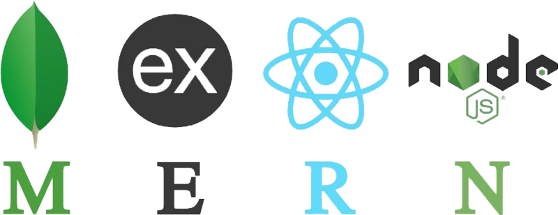
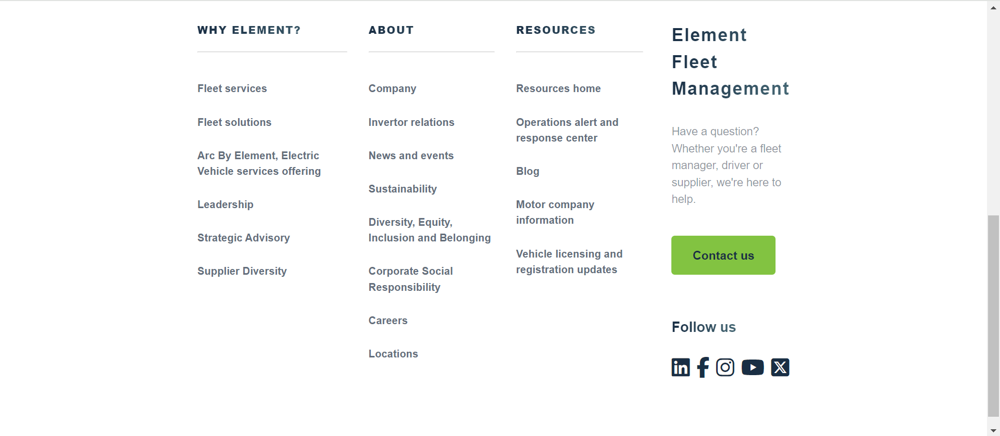
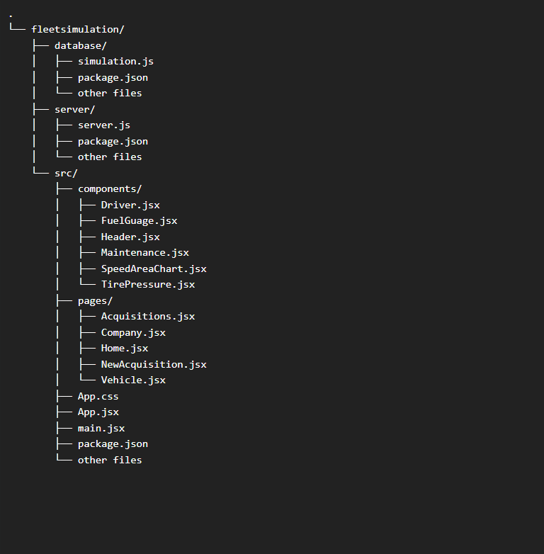

# Element Fleet Simulation
This goal of this web application was to simulate my understanding of what a real-time analytics for a fleet of vehicles would entail. More features can and will be added in the coming future.

### Tech Stack (MERN)
<p align="center">
<b>MongoDB, Expressjs, React, Nodejs</b>
</p>



<br/>
<br/>
<br/>

#### Screenshots of Web Application
- **<u>Home Page</u>**

<!-- <br/> -->
<hr/>

- **<u>New Acquisition Page</u>**

<!-- <br/> -->
<hr/>

- **<u>Companies Acquried</u>**

<!-- <br/> -->
<hr/>

- **<u>Company Vehicles </u>**

<!-- <br/> -->
<hr/>

- **<u>Vehicle Analytics </u>**

<!-- <br/> -->
<hr/>

- **<u>About Page</u>**

<!-- <br/> -->
<hr/>

#### Application File Structure

<!-- <br/> -->
<hr/>

#### How To Run The Application Locally
Three terminals are needed to run the following respectively
- **fleetsimulation/database/simulation.js**: This is the database server that generates real-time data fro all acquired companies, vehicles in the respective companies, and sensory data for the vehicles in any given company fleet. 
    - command to execute
    ```bash
        cd to fleetsimulation/database/
        npm install
        npm run simulate
    ```
- **fleetsimulation/server/server.js**: This is the backend server that handles the web socket connections established by any front-end user. It also handles all the incoming ***API request*** and outgoing ***API responses***.  
    - command to execute
    ```bash
        cd to fleetsimulation/server/
        npm install
        npm run dev
    ```
- **React Front-End**: The package.json in the root directory will be used to install all the client dependencies, build and start the front-end on a port. This project uses **vite**, so the following command can be used:
    - command to execute
    ```bash
        cd to fleetsimulation/
        npm install
        npm run dev
    ```

<!-- <br/> -->
<hr/>

#### Upcomming Features
- [x] Full optimization for mobile responsiveness (Ideally this application should be used on either a tablet, laptop or desktop computer) 
- [ ] Design layout and feature of vehicle maintenance history
- [ ] Design layout and feature of vehicle/driver details
- [ ] User authentication and personalization of user/company acquisitions
- [ ] Other beneficial real-time features such as notifications, driver alerts, real-time positioning of vehicle/driver on a map and so on.

<!-- <br/> -->
<hr/>

## React + Vite

This template provides a minimal setup to get React working in Vite with HMR and some ESLint rules.

Currently, two official plugins are available:

- [@vitejs/plugin-react](https://github.com/vitejs/vite-plugin-react/blob/main/packages/plugin-react/README.md) uses [Babel](https://babeljs.io/) for Fast Refresh
- [@vitejs/plugin-react-swc](https://github.com/vitejs/vite-plugin-react-swc) uses [SWC](https://swc.rs/) for Fast Refresh